# Online Test Program 

- This is a project while I use java and UDP protocol (Network program)
- Tech:
    - Java core
    - Java swing 
    - JDBC
- IDE:
    - Eclipse

# Features:
- CRUD
- Take the test online
- Statistical
- Connect 2 machines via network

# How to run
- Clone this repository
- Make sure you are using JDK 21
- Install the libraries inside Eclipse

## Run by Application 
- Step 1: Install the libraries in Package `Resource/Library` and add the libraries inside Package project
  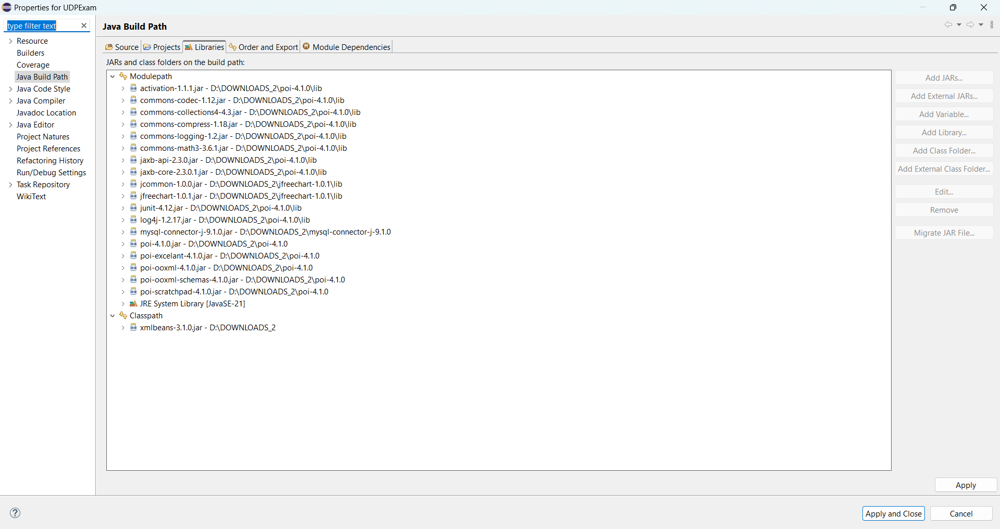
- Step 2: Install Jdk in computer
  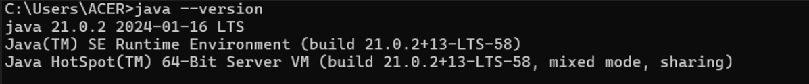
- Step 3: Change environment variables in Package configuration `src/Config/Common.java`
- Finally: Run application by file server.java in Package Server and file client.java in Package Client

### Project functional interface
- Login,Logout interface
  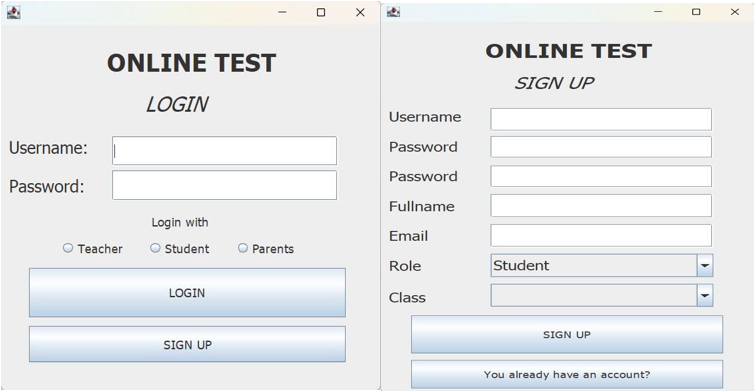
- Student interface
  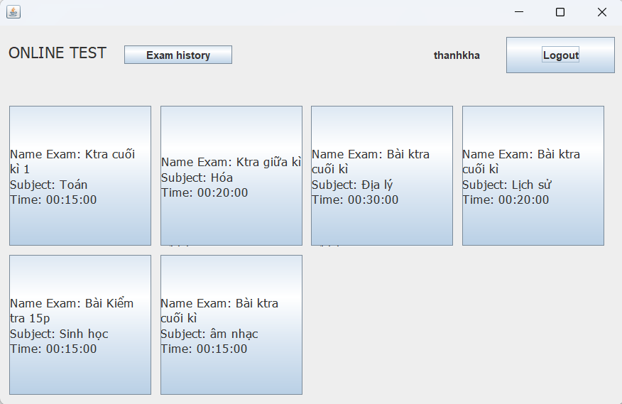
- Test interface
  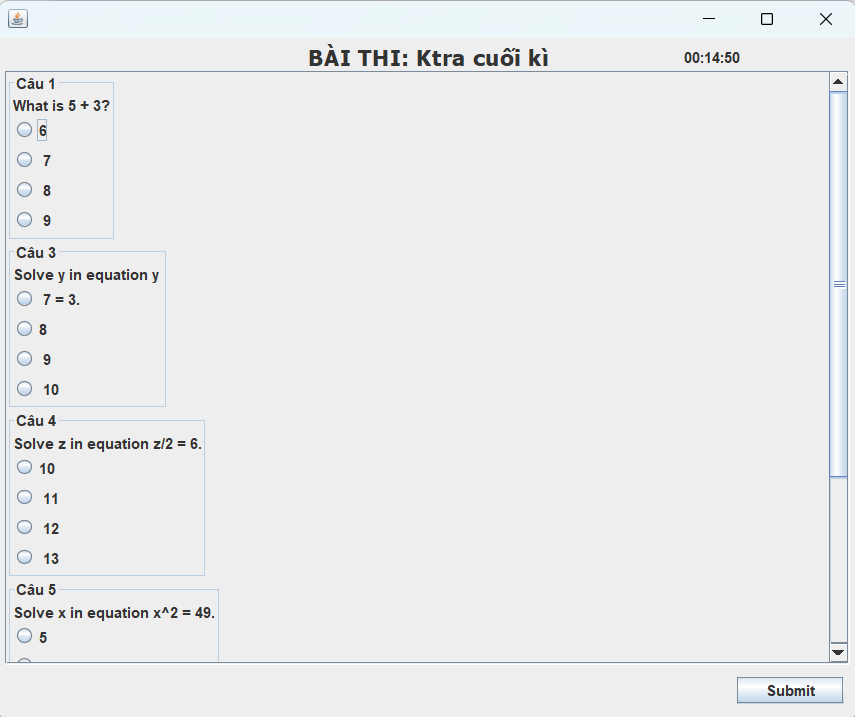
  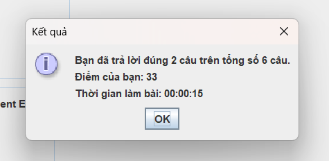
- Test history interface
  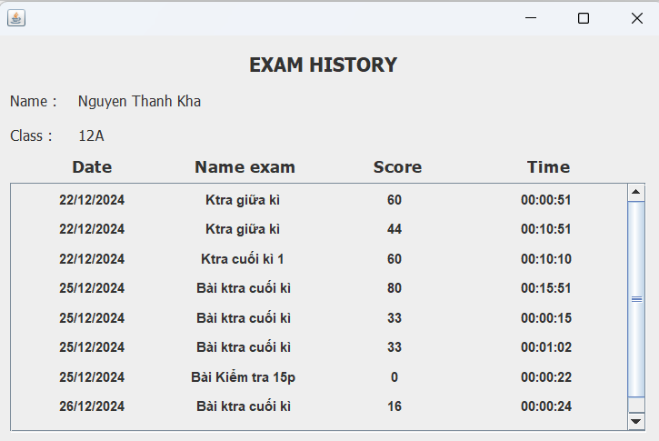
- Teacher interface
  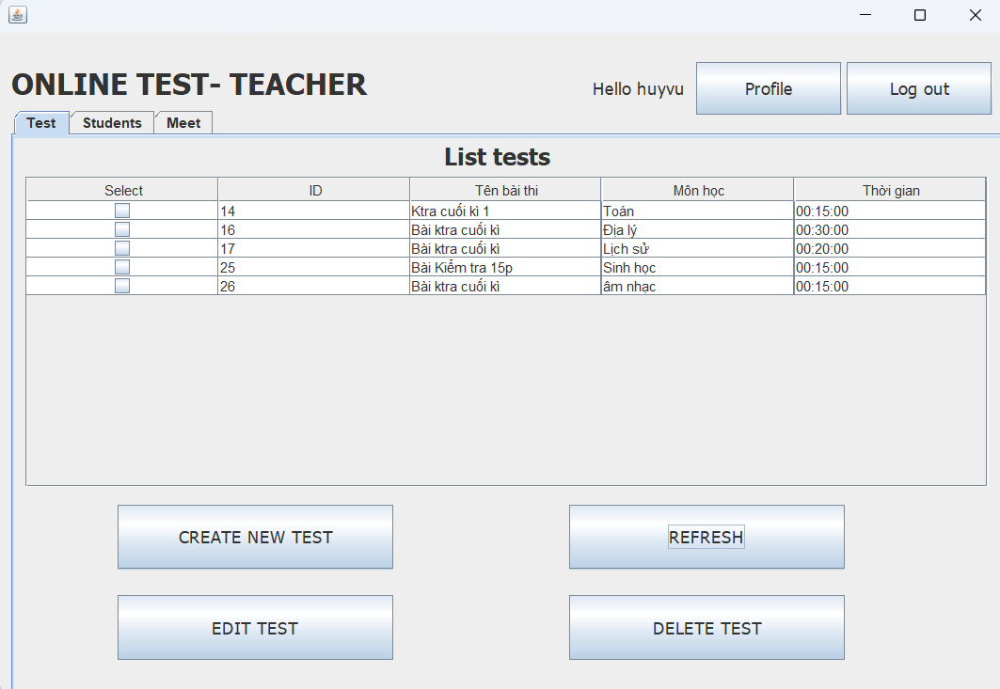
  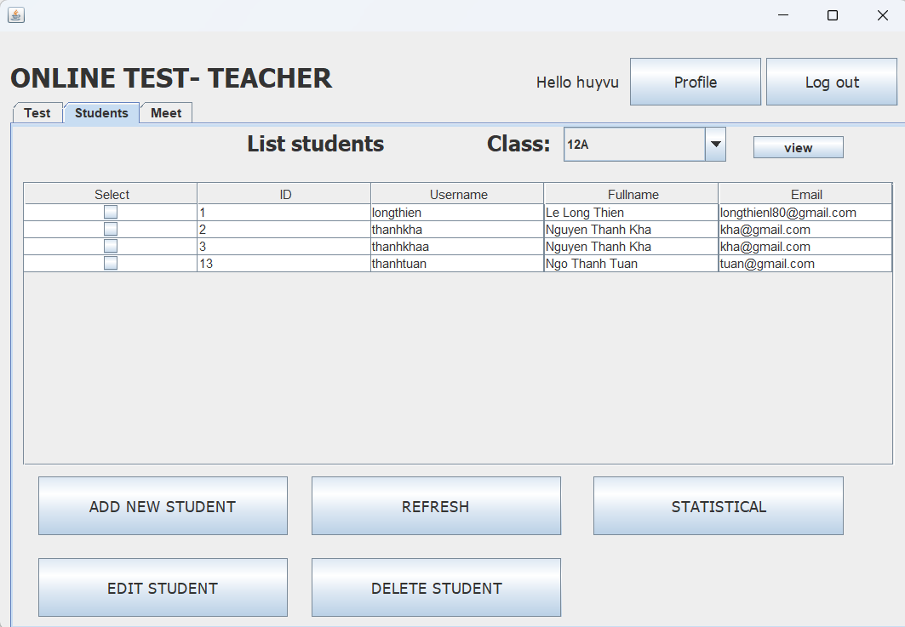
- Statistical interface
  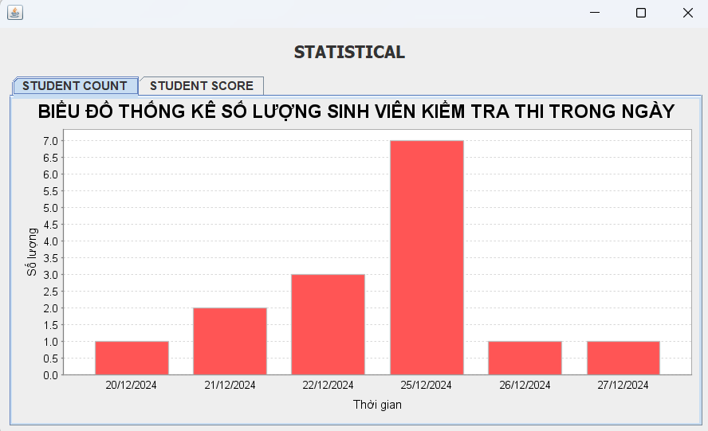
  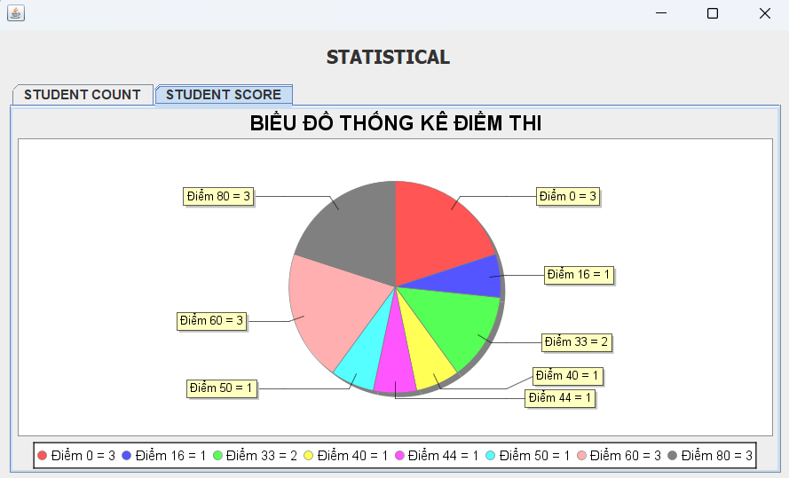
  
#### LINK DEMO

